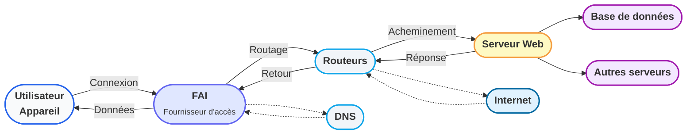

	<h1 class="text-4xl font-bold mb-6 flex items-center justify-center gap-3">🌐 Comment fonctionne Internet&nbsp;?</h1>
	
Un réseau mondial qui relie tout&nbsp;: ordinateurs, serveurs, objets connectés…

---
layout: center
---

	
	<h2 class="text-2xl font-bold mb-3 flex items-center gap-2">🌍 Qu'est-ce qu'Internet&nbsp;?</h2>
	<ul class="text-lg leading-relaxed space-y-2 text-left">
		<li>🔗 Un réseau mondial d'ordinateurs connectés</li>
		<li>🌏 Permet l'échange d'informations partout dans le monde</li>
	</ul>

---
layout: center
---

	
	<h2 class="text-2xl font-bold mb-3 flex items-center gap-2">🧩 Les composants clés</h2>
	<ul class="text-lg leading-relaxed space-y-2 text-left">
		<li>💻 <b>Ordinateurs & appareils</b> : utilisateurs finaux</li>
		<li>📡 <b>Routeurs</b> : dirigent le trafic</li>
		<li>🗄️ <b>Serveurs</b> : stockent et fournissent des données</li>
		<li>🌐 <b>Fournisseurs d'accès (FAI)</b> : connectent les utilisateurs au réseau</li>
	</ul>

---
layout: center
---

	
	<h2 class="text-2xl font-bold mb-3 flex items-center gap-2">🔄 Comment circule l'information&nbsp;?</h2>
	<ol class="list-decimal ml-6 text-lg leading-relaxed space-y-1 text-left">
		<li>L'utilisateur envoie une requête (ex&nbsp;: ouvrir un site web)</li>
		<li>La requête passe par le FAI et des routeurs</li>
		<li>Le serveur reçoit la requête et répond</li>
		<li>Les données reviennent à l'utilisateur</li>
	</ol>

---
layout: center
---

	
	<h2 class="text-2xl font-bold mb-3 flex items-center gap-2">📑 Protocoles essentiels</h2>
	<ul class="text-lg leading-relaxed space-y-2 text-left">
		<li>🛣️ <b>TCP/IP</b> : assure la transmission fiable des données</li>
		<li>🔒 <b>HTTP/HTTPS</b> : pour accéder aux sites web</li>
		<li>🔤 <b>DNS</b> : traduit les noms de domaine en adresses IP</li>
	</ul>

---
layout: center
---

	
	<h2 class="text-2xl font-bold mb-3 flex items-center gap-2">📝 Résumé</h2>
	<ul class="text-lg leading-relaxed space-y-2 text-left">
		<li>🌐 Internet connecte des milliards d'appareils</li>
		<li>📑 Utilise des protocoles pour garantir la communication</li>
		<li>⚡ Permet l'accès rapide à l'information partout</li>
	</ul>

---
title: Schéma récapitulatif Internet
layout: center
---

  <h2 class="text-2xl font-bold mb-4 flex items-center gap-2">🗺️ Schéma récapitulatif</h2>
  

  

  
Ce schéma illustre les principaux composants et flux d'Internet&nbsp;: utilisateurs, FAI, routeurs, serveurs, protocoles…

