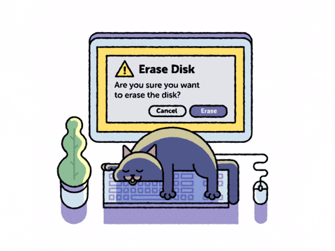
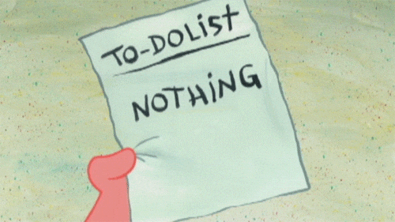

	<h1 class="text-4xl font-bold mb-6 flex items-center justify-center gap-3">🤝 A qui faire confiance&nbsp;?</h1>

---
layout: center
---

  
  <h1 class="text-3xl font-bold mb-4">🛡️ Le RGPD</h1>
  <ul class="text-lg text-left space-y-2 max-w-xl">
    <li>Le <b>RGPD</b> (Règlement Général sur la Protection des Données) est une loi européenne qui protège vos données personnelles.</li>
    <li>Il impose aux entreprises de demander votre consentement et de sécuriser vos informations.</li>
    <li>Vous pouvez demander à accéder, corriger ou supprimer vos données.</li>
  </ul>

---
layout: center
---

  
  <h1 class="text-3xl font-bold mb-4">🔑 Qu’est-ce qu’une donnée personnelle ?</h1>
  <ul class="text-lg text-left space-y-2 max-w-xl">
    <li>Toute information permettant de vous identifier : nom, adresse, email, photo, numéro de téléphone, adresse IP…</li>
    <li>Même une donnée isolée (ex : email) est protégée par la loi.</li>
    <li>Les données sensibles (santé, opinions, etc.) sont encore plus protégées.</li>
  </ul>

---
layout: center
---

  
  <h1 class="text-3xl font-bold mb-4">👤 Mes droits et devoirs sur internet</h1>
  <ul class="text-lg text-left space-y-2 max-w-xl">
    <li><b>Droit d’accès</b>, de rectification, d’opposition et d’effacement de mes données.</li>
    <li><b>Droit à la portabilité</b> (récupérer mes données pour les transférer ailleurs).</li>
    <li><b>Devoir</b> : respecter la vie privée des autres, ne pas diffuser d’informations personnelles sans consentement.</li>
  </ul>

---
layout: center
---

  
  <h1 class="text-3xl font-bold mb-4">🤝 À qui faire confiance ?</h1>
  <ul class="text-lg text-left space-y-2 max-w-xl">
    <li>Privilégier les sites connus, sécurisés (<b>https</b>), et les services transparents sur l’usage des données.</li>
    <li>Se méfier des applications ou sites qui demandent trop d’informations.</li>
    <li>Lire les politiques de confidentialité (même rapidement !).</li>
  </ul>

---
layout: center
---

  
  <h1 class="text-3xl font-bold mb-4">🛡️ Comment protéger mes données ?</h1>
  <ul class="text-lg text-left space-y-2 max-w-xl">
    <li>Utiliser des <b>mots de passe forts et uniques</b>.</li>
    <li>Activer la <b>double authentification</b>.</li>
    <li>Mettre à jour ses logiciels et applications.</li>
    <li>Limiter les informations partagées sur les réseaux sociaux.</li>
    <li>Utiliser des outils de protection (VPN, bloqueur de pub, navigateur privé).</li>
  </ul>

---
layout: center
---

  <h1 class="text-3xl font-bold mb-4 text-primary">🔑 Mots de passe : ma checklist</h1>
  

    <ul class="text-lg text-left space-y-4">
      <li>☐ J’utilise un <b>gestionnaire de mots de passe</b> (ex : Bitwarden ou 1Password)</li>
      <li>☐ Tous mes mots de passe sont <b>différents</b></li>
      <li>☐ Mes mots de passe font <b>au moins 12 caractères</b></li>
      <li>☐ J’ai <b>changé les mots de passe importants cette année</b></li>
    </ul>
  

---
layout: center
---

  <h1 class="text-3xl font-bold mb-4 text-primary">📱 Téléphone : ma checklist</h1>
  

    <ul class="text-lg text-left space-y-4">
      <li>☐ <b>Verrouillage biométrique</b> activé (empreinte / Face ID)</li>
      <li>☐ <b>Code PIN fort</b> (pas 1234)</li>
      <li>☐ <b>Fonction localisation</b> activée (en cas de vol)</li>
      <li>☐ <b>Mises à jour automatiques</b> activées</li>
      <li>☐ Applications inutiles supprimées</li>
      <li>☐ Permissions (micro, caméra, localisation) vérifiées</li>
      <li>☐ Verrouillage automatique rapide (30 secondes – 1 min)</li>
    </ul>
  

---
layout: center
---

  <h1 class="text-3xl font-bold mb-4 text-primary">💻 Ordinateur : ma checklist</h1>
  

    <ul class="text-lg text-left space-y-4">
      <li>☐ <b>Système à jour</b></li>
      <li>☐ <b>Pare-feu activé</b></li>
      <li>☐ <b>Antivirus installé</b></li>
      <li>☐ <b>Sauvegarde récente effectuée</b></li>
      <li>☐ Compte utilisateur standard (pas admin en permanence)</li>
    </ul>
  

---
layout: center
---

  <h1 class="text-3xl font-bold mb-4 text-primary">🌍 Navigation Internet : ma checklist</h1>
  

    <ul class="text-lg text-left space-y-4">
      <li>☐ Je vérifie toujours le <b>HTTPS</b> 🔒</li>
      <li>☐ Je ne clique pas sur des <b>liens suspects</b></li>
      <li>☐ J’utilise un <b>navigateur sécurisé</b> comme Mozilla Firefox ou Brave</li>
      <li>☐ Je refuse les cookies non essentiels</li>
      <li>☐ Je ne publie jamais ma localisation en temps réel</li>
    </ul>
  

---
layout: center
---

  <h1 class="text-3xl font-bold mb-4 text-primary">📧 Emails & Arnaques : ma checklist</h1>
  

    <ul class="text-lg text-left space-y-4">
      <li>☐ Je ne donne jamais mon <b>mot de passe</b> par email</li>
      <li>☐ Je vérifie <b>l’expéditeur</b></li>
      <li>☐ Je me méfie des <b>messages urgents ou menaçants</b></li>
      <li>☐ Je vérifie régulièrement l’activité de connexion</li>
    </ul>
  

---
layout: center
---

  <h1 class="text-3xl font-bold mb-4 text-primary">☁️ Données sensibles : ma checklist</h1>
  

    <ul class="text-lg text-left space-y-4">
      <li>☐ Mes <b>documents importants</b> sont sauvegardés</li>
      <li>☐ Les <b>fichiers sensibles</b> sont protégés par mot de passe</li>
      <li>☐ Je n’expose pas d’<b>informations privées</b> sur les réseaux</li>
      <li>☐ Aucun document sensible en clair sur le cloud</li>
      <li>☐ Nettoyage régulier des anciens fichiers</li>
    </ul>
  

---
layout: center
---

  <h1 class="text-3xl font-bold mb-4 text-primary">🛡️ Réseaux sociaux : ma checklist</h1>
  

    <ul class="text-lg text-left space-y-4">
        <li>☐ Profil privé</li>
        <li>☐ Liste d’amis vérifiée</li>
        <li>☐ Date de naissance masquée</li>
        <li>☐ Numéro de téléphone non public</li>
        <li>☐ Authentification renforcée activée</li>
    </ul>
  

---
layout: center
---

  <h1 class="text-3xl font-bold mb-4 text-primary">🎯 BONUS (niveau avancé)</h1>
  

    <ul class="text-lg text-left space-y-4">
      <li>☐ J’utilise un <b>VPN</b> sur Wi-Fi public</li>
      <li>☐ Je vérifie les <b>autorisations des applications</b></li>
      <li>☐ J’ai <b>supprimé les comptes inutilisés</b></li>
      <li>☐ Je surveille les fuites de données</li>
      <li>☐ Je change immédiatement les mots de passe après alerte</li>
      <li>☐ J’ai activé les alertes bancaires en temps réel</li>
      <li>☐ Je surveille mes connexions suspectes</li>
    </ul>
  

